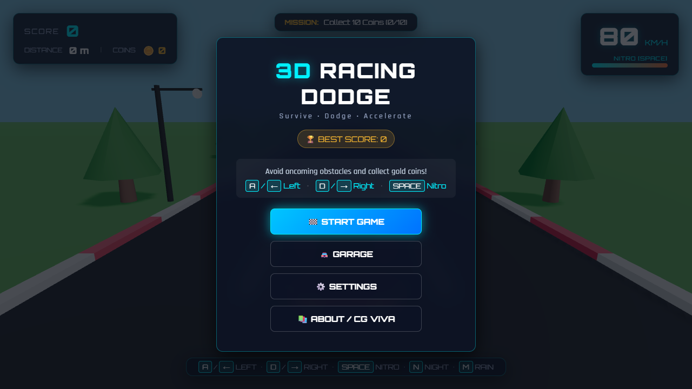
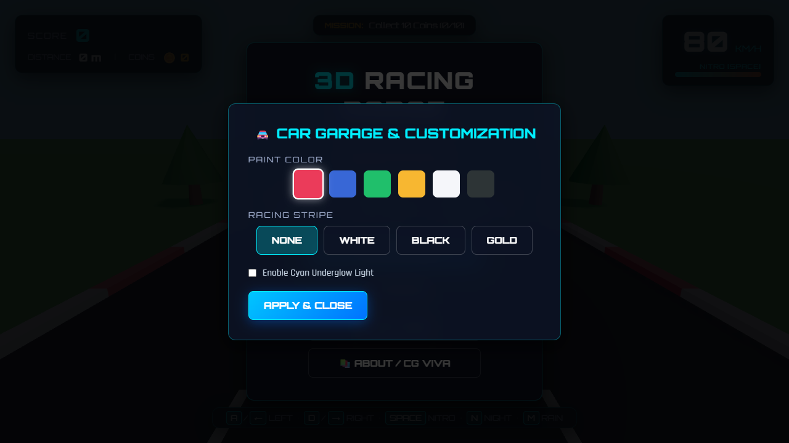
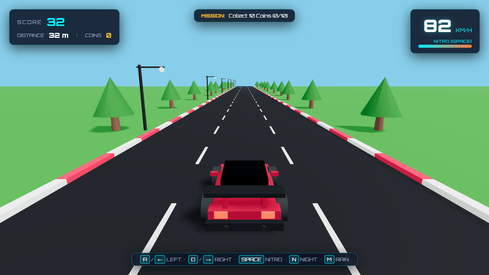
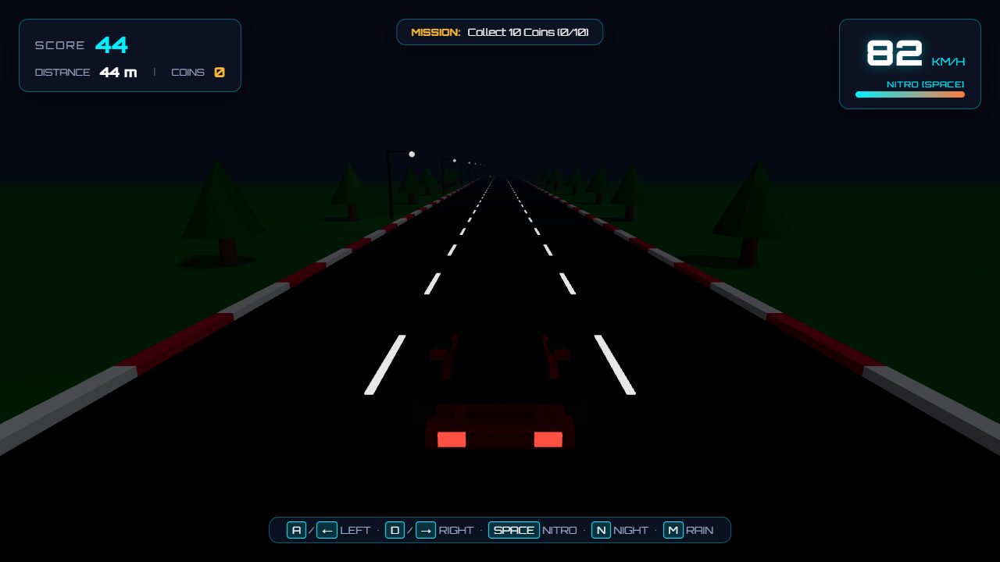

# 🏎️ 3D Racing Dodge — Computer Graphics Project

> A feature-rich, high-performance, real-time 3D arcade dodge racing game built from scratch using **Three.js**, **JavaScript ES6 Modules**, **HTML5**, and **CSS3**. Developed as a flagship Computer Graphics college project.

---

## 📸 Screenshots

| Start Menu & High Scores | Car Customization Garage |
|:------------------------:|:------------------------:|
|  |  |

| Daytime Gameplay & Nitro | Nighttime Lighting & Headlights |
|:------------------------:|:-------------------------------:|
|  |  |

---

## 🌟 Key Features

* **🏎️ Hand-Built Low-Poly Racing Car**: Constructed using hierarchical Three.js primitives (`THREE.Group`) without external GLB dependencies. Features custom body, hood, cabin, tinted glass, spoiler, front/rear bumpers, side mirrors, dual exhaust pipes, and 4 wheel sub-assemblies with metallic rims.
* **🚘 Garage & Customization**: Change body paint colors (Red, Blue, Green, Yellow, White, Black), add optional racing stripes (White, Black, Gold), and toggle cyan Underglow lights.
* **🔥 Nitro Boost System (`SPACE`)**: Speed jumps by +80 KM/H, dynamic Perspective Camera FOV expansion ($60^\circ \to 78^\circ$), subtle camera shake, and particle exhaust flames bursting from dual tailpipes.
* **🪙 3D Gold Coin Collectibles**: 3D spinning gold coins spawned in straight lines and zig-zag patterns across lanes. Features collection detection, coin shrink animations, and floating `+100` HUD indicators.
* **🌙 Dynamic Day / Night Mode (`N`)**: Seamless toggle between bright daylight and night mode featuring ambient attenuation, illuminated roadside streetlight poles, and car headlight beams.
* **🌧️ Weather System (`M`)**: Toggle particle rain (`THREE.Points`) with wet road material reflectivity (dynamic roughness modification from $0.80$ to $0.25$).
* **🎯 Dynamic Mission Challenges**: Active in-game missions (e.g., *"Collect 10 Coins"*, *"Survive 500m"*, *"Reach 150 KM/H"*) awarding +500 score bonuses upon completion.
* **🏆 Persistent High Scores**: Automatically saves `bestScore`, `bestDistance`, and `bestCoins` to `localStorage` with celebratory high score badges.
* **⚡ Progressive Difficulty**: Automatic speed scaling over distance (80 KM/H $\to$ 180+ KM/H) with selectable difficulty modes (Easy, Normal, Hard).

---

## 🎮 Controls

| Key | Action |
|:---:|:---|
| <kbd>A</kbd> / <kbd>←</kbd> | Move Left (Smooth Lerp + Body Roll Tilt) |
| <kbd>D</kbd> / <kbd>→</kbd> | Move Right (Smooth Lerp + Body Roll Tilt) |
| <kbd>SPACE</kbd> | Activate Nitro Boost |
| <kbd>N</kbd> | Toggle Day / Night Mode |
| <kbd>M</kbd> | Toggle Weather (Clear / Rain) |
| <kbd>ESC</kbd> | Pause Game |

---

## 🧮 Computer Graphics Syllabus Coverage

This project demonstrates core Computer Graphics algorithms and mathematical concepts:

1. **3D Homogeneous Transformations**: 4x4 Transformation Matrices for Translation $T(t_x, t_y, t_z)$, Rotation $R_y(\theta), R_z(\phi)$, and Scaling $S(s_x, s_y, s_z)$.
2. **Hierarchical Modeling**: Parent-child matrix stack (`THREE.Group`) organizing car chassis, cabin, spoiler, and wheels.
3. **Perspective Projection Matrix**: Dynamic perspective camera frustum mapping 3D world points to Normalized Device Coordinates (NDC) with dynamic FOV manipulation ($\theta = 60^\circ \to 78^\circ$).
4. **Phong Illumination Model**: PBR `MeshStandardMaterial` applying Ambient, Diffuse ($\hat{N} \cdot \hat{L}$), and Specular ($\hat{R} \cdot \hat{V})^n$ reflection equations.
5. **Dynamic Shadow Mapping**: `PCFSoftShadowMap` rendering dynamic directional sunlight and streetlight shadows onto the asphalt surface.
6. **Z-Buffer Depth Testing**: Hardware depth buffer occlusion rendering across overlapping geometry primitives.
7. **Axis-Aligned Bounding Box (AABB) Collision**: Real-time `THREE.Box3` intersection testing between vehicle bounds and procedural obstacles.
8. **Particle Systems**: High-performance `THREE.Points` particle system for rain simulation, tire smoke, and nitro exhaust flames.
9. **Linear Interpolation (Lerp)**: Smooth frame-rate independent position lerping $x_{next} = \text{Lerp}(x_{curr}, x_{target}, \alpha)$ and camera tracking.

---

## 📁 Project Structure

```
racing/
├── index.html                   # Main HTML container & UI layer
├── package.json                 # Project metadata & scripts
├── vite.config.js               # Vite bundler configuration
├── Computer_Graphics_Project_Report.docx  # Complete 6-Page Academic Report
├── ui/                          # Repository Screenshots
│   ├── start_menu.png
│   ├── garage_customization.png
│   ├── gameplay_day.png
│   └── gameplay_night.png
└── src/
    ├── main.js                  # Entry point & requestAnimationFrame loop
    ├── car/
    │   └── HandbuiltCar.js      # Procedural vehicle hierarchy & customization
    ├── environment/
    │   └── RoadEnvironment.js   # 3-lane road, lane dashes, scenery, streetlights
    ├── obstacles/
    │   └── ObstacleManager.js   # Dynamic obstacle wave generation & AABB collision
    ├── collectibles/
    │   └── CoinManager.js       # 3D Gold coin patterns & pickup logic
    ├── effects/
    │   └── ParticleSystem.js    # Tire smoke, nitro flames, rain, crash debris
    ├── game/
    │   ├── GameManager.js       # State machine, progression, high scores
    │   └── Timer.js             # Precision timer
    ├── scene/
    │   ├── SceneManager.js      # Renderer, Camera & SRGB setup
    │   ├── Lighting.js          # Day/Night lighting transitions
    │   └── Environment.js       # Atmospheric fog
    ├── ui/
    │   ├── HUD.js               # In-game HUD controller
    │   └── MainMenu.js          # Start menu, Garage & Settings modals
    └── utils/
        ├── AudioSystem.js       # Web Audio API engine synth & sound FX
        └── MathUtils.js         # Lerp, clamp, formatting utilities
```

---

## 🚀 Getting Started

### Prerequisites
- [Node.js](https://nodejs.org/) (v16 or higher)
- `npm` or `yarn`

### Installation & Execution

1. **Clone the repository**:
   ```bash
   git clone https://github.com/FahadS5534/racing.git
   cd racing
   ```

2. **Install dependencies**:
   ```bash
   npm install
   ```

3. **Launch local development server**:
   ```bash
   npm run dev
   ```
   Open your browser at `http://localhost:3000/`.

4. **Build production bundle**:
   ```bash
   npm run build
   ```

---

## 📄 Academic Project Report

A complete **6-Page Academic Project Report** formatted as a Microsoft Word Document is included in the root folder:

📄 **[Computer_Graphics_Project_Report.docx](Computer_Graphics_Project_Report.docx)**

Includes complete mathematical derivations, matrix formulations, Phong shading equations, pipeline diagrams, and a viva examination preparation guide.
